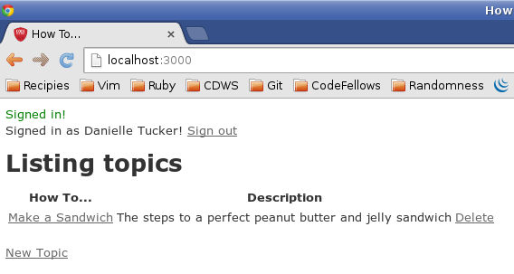
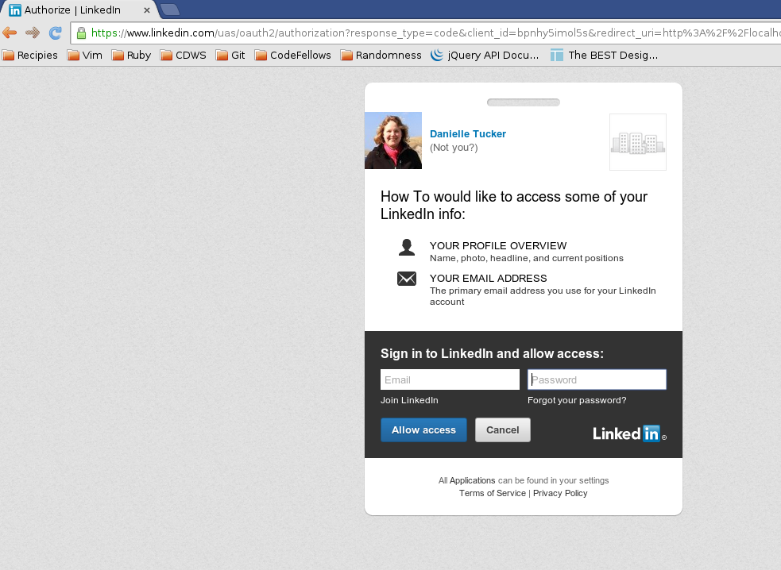

### How To (CodeFellows - App A Day: Nested Resources and OAuth)

This micro app provides the ability to have a Collaborative How-To site where users can create tasks with steps

### Concepts Utilized
* Nested Resources
* OAuth sign-in via LinkedIn
* Authorization restrictions if not signed in (once signed in, basically a global user)

## Show Me

Screenshots:



Authentication with LinkedIn



## Project Setup
```
$ git clone git@github.com:tuckerd/how_to.git
$ cd how_to
$ rake db:setup`
```
You will need a LinkedIn API Key.  [LinkedIn Developer Registration](https://www.linkedin.com/secure/developer)
Make sure you select r_fullprofile for the default scope
Once you have the API Key and Secret Key for the app (you can call it whatever you want) put the following in a file
called .env located in the root directory (how_to/.env)
```
  LINKEDIN_KEY='your API key here'
  LINKEDIN_SECRET='your secret key here'
```
Then you should be all set up!

`rails s`

Go to browser and go to localhost:3000

### Known Issues

If you discover any bugs, feel free to create an issue on GitHub fork and
send us a pull request.

## Contributing

1. Fork it
2. Create your feature branch (`git checkout -b my-new-feature`)
3. Commit your changes (`git commit -am 'Add some feature'`)
4. Push to the branch (`git push origin my-new-feature`)
5. Create new Pull Request


## License

The MIT License (MIT)
